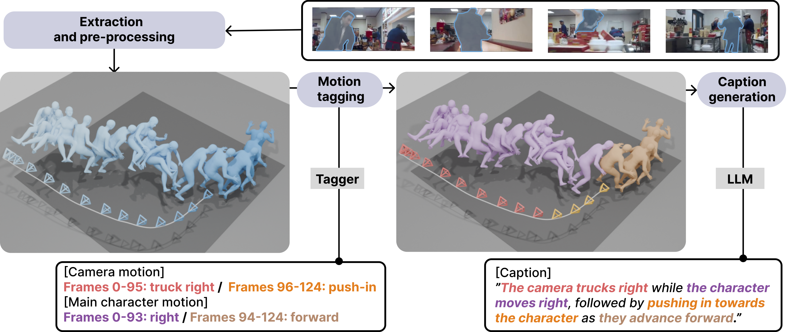

<div align="center">

# E.T. the Exceptional Trajectories
## Dataset

<a href="https://robincourant.github.io/info/"><strong>Robin Courant</strong></a>
·
<a href="https://nicolas-dufour.github.io/"><strong>Nicolas Dufour</strong></a>
·
<a href="https://triocrossing.github.io/"><strong>Xi Wang</strong></a>
·
<a href="http://people.irisa.fr/Marc.Christie/"><strong>Marc Christie</strong></a>
·
<a href="https://vicky.kalogeiton.info/"><strong>Vicky Kalogeiton</strong></a>

[]()

</div>


<div align="center">
    <a href="https://www.lix.polytechnique.fr/vista/projects/2024_et_courant/" class="button"><b>[Webpage]</b></a> &nbsp;&nbsp;&nbsp;&nbsp;
    <a href="https://huggingface.co/spaces/robin-courant/DIRECTOR-demo" class="button"><b>[Demo]</b></a> &nbsp;&nbsp;&nbsp;&nbsp;
    <a href="https://github.com/robincourant/DIRECTOR" class="button"><b>[DIRECTOR]</b></a> &nbsp;&nbsp;&nbsp;&nbsp;
    <a href="https://github.com/robincourant/CLaTr" class="button"><b>[CLaTr]</b></a> &nbsp;&nbsp;&nbsp;&nbsp;
</div>

<br/>



---

**Download the preprocessed dataset**

Check the data repository [here](https://huggingface.co/datasets/robin-courant/et-data).

First, install `git lfs` by following the instructions [here](https://docs.github.com/en/repositories/working-with-files/managing-large-files/installing-git-large-file-storage).


To get the data, run:
```
cd /PATH/TO/THE/DATASET
git clone https://huggingface.co/datasets/robin-courant/et-data
```

Prepare the dataset (untar archives):
```
cd et-data
sh untar_and_move.sh
```
<br>

---

## Getting started

<details><summary>Create environment</summary>
&emsp;

Create conda environment:
```
conda create --name et python=3.10 -y
conda activate et
```

Install dependencies and [SLAHMR](https://github.com/vye16/slahmr) (torch===1.13.1 and CUDA==11.7):
```
sh ./setup.sh
```

Install `pytorch3d` (installation can be tricky, follow the [official guidelines](https://github.com/facebookresearch/pytorch3d/blob/main/INSTALL.md) if you encounter any issues.):
```
conda install pytorch3d -c pytorch3d
```


</details>
<br>

<details><summary>Set up the dataset</summary>
&emsp;

The E.T. dataset is built upon [CondensedMovies](https://www.robots.ox.ac.uk/~vgg/data/condensed-movies/) dataset.
Follow the instructions [here](https://github.com/m-bain/CondensedMovies) to download CondensedMovies.

Finally, add a symlink in this repository to the CondensedMovies repository:
```
ln -s PATH/TO/CondensedMovies ./data
```

</details>
<br>

## Usage

<details><summary>E.T. frames extraction</summary>
&emsp;

Here are the instructions to extract frames from the E.T. dataset.

First, you need a copy of both the [CondensedMovies](https://www.robots.ox.ac.uk/~vgg/data/condensed-movies/) and the [E.T](https://huggingface.co/datasets/robin-courant/et-data) datasets.

Then, run the following script:
```
python scripts/misc/extract_frames.py /PATH/TO/CondensedMovies /PATH/TO/et-data
```

</details>
<br>
---

Here are the instructions for running the data extraction scripts to reproduce the E.T. dataset.

1. Perform SLAHMR extraction:
```
python scripts/slahmr_extraction.py data.metadata_filename='data/metadata/clips.csv'
```

2. Gather all extracted chunks into one file:
```
python scripts/extraction/slahmr_processing.py /PATH/TO/slahmr_out --dirname smooth_fit
```

3. Align extracted chunks:
```
python scripts/processing/trajectory_alignment.py /PATH/TO/slahmr_out /PATH/TO/et-data
```

4. Clean and smooth extracted trajectories:
```
python scripts/processing/trajectory_cleaning.py /PATH/TO/et-data
```

5. Create dataset and split to samples:
```
python scripts/processing/dataset_processing.py /PATH/TO/et-data -c -v /PATH/TO/CondensedMovies
```

6. Shift all samples according to the origin of the character:
```
python scripts/misc/dataset_processing.py /PATH/TO/et-data
```

## Visualization

There are 2 different ways of visualizing samples, using [blender](https://www.blender.org/) and [rerun](https://rerun.io/).

Note: You will need meshes, which are not yet released with the dataset.

<details><summary>Blender visualization</summary>
&emsp;

First, install blender:
1. Follow the [official instructions](https://www.blender.org/download/).
2. Locate the python installation used by **conda** with the following line (`/PATH/TO/CONDA/ENV/`):
   ```
   conda env list | grep '*'
   ```
3. Locate the python installation used by **blender** with the following line (`/PATH/TO/BLENDER/python`):
   ```
   blender --background --python-expr "import sys; import os; print('\nThe path to the installation of python of blender can be:'); print('\n'.join(['- '+x.replace('/lib/python', '/bin/python') for x in sys.path if 'python' in (file:=os.path.split(x)[-1]) and not file.endswith('.zip')]))"
   ```
4. Link conda env to blender python with the following line:
   ```
   ln -s /PATH/TO/CONDA/ENV/ /PATH/TO/BLENDER/python
   ```

To launch Blender through the command line, run:
```
blender PATH/TO/BLENDER_FILENAME
```

Then, in Blender, go to the `Scripting` tab and open `visualization/blender_viz.py`.

Next, go to the `Modifiers` tab (wrench tool icon), enter your desired parameters, and generate your scene.


</details>
<br>

<details><summary>Rerun visualization</summary>
&emsp;

To launch Rerun visualization script, run:
```
python visualization/rerun_viz.py /PATH/TO/et-data
```

</details>
<br>
